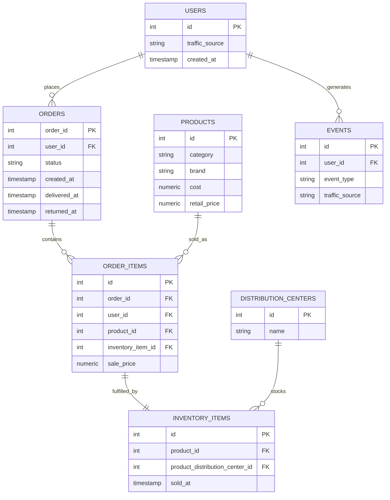

# TheLook E-commerce SQL Analytics

### 90 Business Questions. One E-commerce Dataset. End-to-End Decision Analytics.


An end-to-end BigQuery SQL analytics project that transforms TheLook E-commerce data into 90 business-focused analyses across customers, revenue, products, retention, marketing, profitability, logistics, inventory, and user engagement.

This is not a set of SQL syntax exercises — it's a decision-oriented analysis of a full e-commerce business, built entirely on `bigquery-public-data.thelook_ecommerce`.

---

## Project Snapshot

| Project Scope | Details |
|---|---|
| Dataset | TheLook E-commerce (`bigquery-public-data.thelook_ecommerce`) |
| Platform | Google BigQuery |
| Analyses | 90 business questions |
| Primary language | SQL |
| Source tables | 7 (`users`, `orders`, `order_items`, `products`, `inventory_items`, `distribution_centers`, `events`) |
| Focus | Customer, product, revenue, retention, marketing, profitability, and operations analytics |

### What this project answers

- Who are the customers, and which of them have never converted to buyers?
- How is revenue distributed across time, categories, brands, and customers?
- Which products and categories perform — and which are quietly unprofitable?
- Which customers are most valuable, and how are they trending?
- How strong is customer retention, and how does it break down by cohort?
- Where are returns, cancellations, and delivery delays concentrated?
- Which acquisition channels perform best, and what do they cost in engagement terms?
- Which distribution centers are fastest, most profitable, and most return-prone?
- How engaged are users on the platform, by traffic source and event type?
- How healthy is inventory sell-through?

---

## Repository Structure

```
thelook-ecommerce-sql-analytics/
│
├── README.md
│
├── sql/
│   ├── 01_customer_and_order_analysis.sql
│   ├── 02_revenue_and_product_analysis.sql
│   ├── 03_customer_retention_analysis.sql
│   ├── 04_marketing_and_traffic_analysis.sql
│   ├── 05_profitability_analysis.sql
│   ├── 06_distribution_and_operations_analysis.sql
│   ├── 07_events_and_engagement_analysis.sql
│   └── 08_inventory_and_advanced_analysis.sql
│
├── docs/
│   ├── data_dictionary.md      → table grain, columns, join map
│   ├── business_questions.md   → all 90 questions, mapped to SQL files
│   ├── sql_concepts.md         → SQL techniques demonstrated
│   └── methodology.md          → analytical approach and key lessons
│
├── results/
│   └── README.md                → how to reproduce results in BigQuery
│
├── assets/
│   └── README.md
│
├── LICENSE
└── .gitignore
```

Each SQL file corresponds to one analytical domain. Every query retains its original question number (`q01`–`q90`) as an inline comment, so any query can be traced back to `docs/business_questions.md` and vice versa.

---

## Data Model

**Grain of each table:**

| Table | Grain |
|---|---|
| `users` | One row per customer |
| `orders` | One row per order |
| `order_items` | One row per product line item within an order |
| `products` | One row per product |
| `inventory_items` | One row per physical inventory unit |
| `distribution_centers` | One row per warehouse |
| `events` | One row per website/app activity event |



Full column-level detail and the join map are in [`docs/data_dictionary.md`](docs/data_dictionary.md).

---

## Business Analytics Domains

<table>
<tr><td valign="top" width="33%">

**Customer Analytics**
- Acquisition & conversion
- Repeat vs. one-time customers
- Segmentation (RFM-style)
- Recency
- Customer value
- Cohort-based retention

**Revenue Analytics**
- Average order value
- Monthly revenue & MoM growth
- Revenue contribution %
- Revenue concentration

**Product Analytics**
- Category & brand performance
- Top products by revenue/volume
- Sales volume
- Product-level returns

</td><td valign="top" width="33%">

**Profitability**
- Product / category / brand profit
- Profit margin
- High-volume, low-margin detection

**Operations**
- Delivery time
- Return & cancellation rate
- Distribution center performance
- Inventory sell-through

**Marketing**
- Traffic source performance
- Revenue & conversion by source
- Acquisition by channel

</td><td valign="top" width="33%">

**User Engagement**
- Event volume by type
- Events per user
- Traffic-source engagement

**Geography**
- Customers & revenue by country

**Advanced KPIs**
- Multi-metric category scorecards
- Top-N revenue concentration

</td></tr>
</table>

---

## Business Questions

All 90 questions are documented in full — grouped by domain, each mapped to its SQL file — in [`docs/business_questions.md`](docs/business_questions.md).

<details>
<summary><strong>Preview: first 10 of 90</strong></summary>

| # | Business Question |
|---|---|
| q01 | Determine the total number of users on the platform |
| q02 | Calculate the total number of orders placed by customers |
| q03 | Measure the number of customers who converted into buyers (at least one order) |
| q04 | Identify registered users who have not made any purchases |
| q05 | Calculate the average revenue generated per order |
| q06 | Identify the highest revenue-generating customers |
| q07 | Analyze category-wise revenue contribution to identify top-performing categories |
| q08 | Calculate each category's contribution to total company revenue |
| q09 | Rank products by revenue inside each category |
| q10 | Compare customer segments by purchase frequency and revenue contribution |

→ [See all 90 in `docs/business_questions.md`](docs/business_questions.md)

</details>

---

## SQL Concepts Demonstrated

`SELECT` · `WHERE` · `GROUP BY` · `HAVING` · `ORDER BY` · `DISTINCT` · `CASE WHEN` · `COUNT` / `COUNT(DISTINCT)` · `COUNTIF` · `SUM` / `AVG` / `MIN` / `MAX` · CTEs (`WITH`) · subqueries · `JOIN` / `LEFT JOIN` (up to 4 tables deep) · window functions (`OVER`, `PARTITION BY`) · `LAG` · `ROW_NUMBER` · `DENSE_RANK` · `DATE_TRUNC` · `DATE_DIFF` / `TIMESTAMP_DIFF` · `FORMAT_DATE` / `FORMAT_TIMESTAMP` · `DATE_ADD` · `SAFE_DIVIDE` · conditional aggregation · cohort analysis · revenue contribution · profit margin · customer segmentation

Full breakdown with example questions per concept: [`docs/sql_concepts.md`](docs/sql_concepts.md).

---

## Business Metrics Glossary

| Metric | Definition | Why it matters |
|---|---|---|
| **AOV** (Average Order Value) | Average of `sale_price` summed per order, then averaged across orders | Reveals whether revenue growth comes from more orders or bigger baskets |
| **Revenue** | `SUM(sale_price)` at the relevant grain | The base unit for nearly every downstream KPI |
| **Revenue Contribution %** | A group's revenue ÷ total revenue × 100 | Shows concentration — e.g. whether 10 products drive an outsized share of sales |
| **MoM Growth** | `(current period − prior period) / prior period × 100` | Tracks momentum, not just absolute level |
| **Return Rate** | Returned orders ÷ total orders (with an explicit, stated denominator) | A rate is meaningless without knowing what it's a rate *of* |
| **Retention Rate** | Customers who order again within a defined window ÷ customers acquired in that cohort | Measures whether growth is compounding or just replacing churn |
| **Revenue per Customer** | Total revenue ÷ distinct customers | Normalizes revenue by customer base size for fair comparison across segments |
| **Profit** | `sale_price − cost`, summed at the relevant grain | Revenue without cost is an incomplete picture of performance |
| **Profit Margin** | Profit ÷ revenue × 100 | Distinguishes high-revenue products from high-*value* products |
| **Units Sold** | Count of order items at the relevant grain | Volume metric, used alongside revenue and margin to catch high-volume/low-margin products |
| **Events per User** | Total events ÷ distinct users | A proxy for engagement depth, not just reach |
| **Delivery Time** | `delivered_at − created_at`, orders with a null delivery date excluded | Operational health metric independent of order volume |

---

## Methodology

1. Understand table grain before writing any SQL.
2. Identify the actual business question being asked.
3. Select the correct table(s) — revenue lives in `order_items`, not `products.retail_price`.
4. Join using only validated foreign keys from the data dictionary.
5. Aggregate at the correct grain, using CTEs to separate raw aggregation from final shaping.
6. Apply business logic (segmentation, thresholds, date windows) explicitly and visibly.
7. Validate edge cases — nulls, zero denominators, low-volume groups.
8. Calculate the KPI, rounding only in the final `SELECT`.
9. Interpret the result in business terms.

Full write-up, including why `COUNT(DISTINCT order_id)` matters and why AOV must be computed at order level, not item level: [`docs/methodology.md`](docs/methodology.md).

---

## Business Logic & Assumptions

**Revenue date.** Monthly *delivered* revenue analysis (q11) uses `delivered_at`, not `created_at`, because the question is about revenue associated with successfully delivered orders, not placed orders.

**Customer recency.** `orders.created_at` is used to determine a customer's most recent purchase activity, since the question concerns when an order was *placed*.

**Delivery time.** Calculated from `created_at` to `delivered_at`; orders without a delivery timestamp are excluded rather than treated as zero or infinite delay.

**Return rate.** Returned orders ÷ total orders, with the denominator always stated. Several queries add a minimum order-count threshold (via `HAVING`) so a single-order group can't register a misleading 100% or 0% rate.

**Order grain.** `orders` = one row per order.

**Order-item grain.** `order_items` = one row per product within an order — never conflated with order-level counts.

---

## Data Quality & Validation Notes

The dataset is a realistic, imperfect public dataset — this project doesn't assume otherwise. Validation checks applied throughout:

- **Null delivery / return dates** — explicitly filtered with `IS NOT NULL` rather than silently coerced, since a null here means "hasn't happened yet," not zero.
- **Division by zero** — every ratio uses `SAFE_DIVIDE` instead of `/`.
- **Order-level vs. item-level double counting** — `COUNT(DISTINCT order_id)` used whenever `order_items` is joined into an order-level question.
- **Customers with no orders** — handled explicitly with `LEFT JOIN ... WHERE ... IS NULL` (q04) rather than assumed away.
- **Low-volume groups** — categories, brands, and distribution centers with very few orders are filtered with `HAVING` thresholds before computing rates, since a rate on 2 orders is not a reliable signal.

---

## How to Run

1. Open the [BigQuery console](https://console.cloud.google.com/bigquery) (the free sandbox tier works — no billing setup required to query public datasets).
2. Open a new SQL workspace.
3. `bigquery-public-data.thelook_ecommerce` is a public dataset — no import or setup needed.
4. Copy any query from `sql/` and run it directly; each query is fully self-contained and fully qualified.
5. Review results in the BigQuery UI or export as needed.

No credentials, environment variables, or local setup are required. See [`results/README.md`](results/README.md) for more detail.

---

## Why This Project Matters

The hard part of analytics isn't SQL syntax — it's translating an ambiguous business question into a correctly-scoped query: picking the right grain, the right date field, the right denominator, and the right join path, then being honest about the edge cases.

This project demonstrates:

- **Problem decomposition** — breaking "how healthy is retention" into cohort, recency, and repeat-purchase-rate sub-questions
- **Metric definition** — stating exactly what AOV, return rate, and retention rate mean before calculating them
- **Data modeling** — reasoning about grain across 7 related tables
- **Analytical SQL** — CTEs, window functions, and conditional aggregation used purposefully, not decoratively
- **Business interpretation** — every query answers a question a stakeholder would actually ask
- **Edge-case awareness** — nulls, zero denominators, and low-sample groups handled deliberately
- **KPI design** — metrics built with a stated formula and a stated reason they matter

### Interview-ready skills demonstrated

- Writing multi-CTE analytical SQL from a business question, not from a schema diagram alone
- Choosing between `DENSE_RANK()` and `ROW_NUMBER()` based on how ties should behave
- Diagnosing and avoiding double-counting from grain mismatches in joins
- Designing rate-based KPIs with explicit, defensible denominators
- Cohort and RFM-style customer segmentation in raw SQL
- Reading and working within an unfamiliar production-like schema (7 tables, denormalized inventory fields, nullable lifecycle timestamps)

---

## License

MIT — see [LICENSE](LICENSE).
