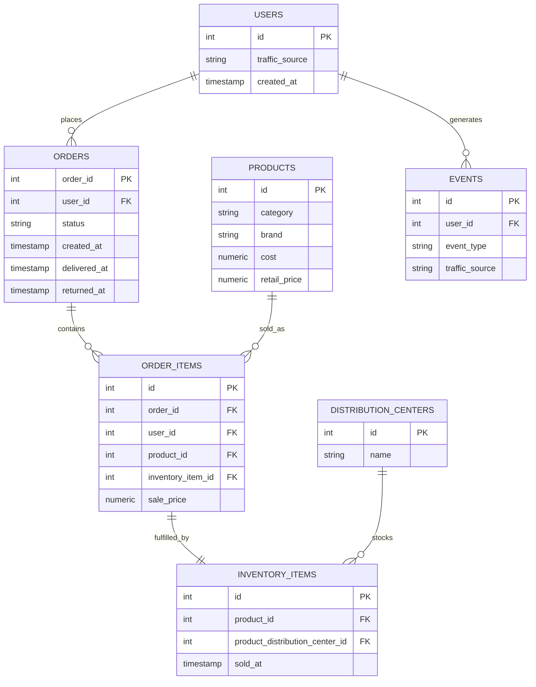

# TheLook E-commerce SQL-Driven Business & Decision Analytics

### 90 Business Questions · BigQuery · From Raw Data to Executive Decisions


A SQL-driven business analytics project built on `bigquery-public-data.thelook_ecommerce`. 90 business questions were investigated in BigQuery, the most decision-relevant outputs were then curated into an executive analysis layer with real findings, evidence-based insights, and prioritized recommendations.

**This isn't a "90 SQL questions" repository.** It's a business investigation that happens to be conducted entirely in SQL: raw e-commerce data → 90 business questions → BigQuery analysis → selected decision-relevant outputs → business insights → recommended actions.

---

## 1. Project Overview

| | |
|---|---|
| **Dataset** | `bigquery-public-data.thelook_ecommerce` (public BigQuery dataset) |
| **Platform** | Google BigQuery |
| **Scope** | 90 business questions across customer, revenue, product, retention, marketing, profitability, and operations analytics |
| **Decision layer** | 41 of the 90 outputs curated into an executive analysis with real KPIs, findings, and recommendations |
| **Primary language** | SQL |

## 2. Business Objective

Simulate the role of an analyst asked to understand the health of an e-commerce business end-to-end: is revenue growing, are customers returning, which products and categories drive value, where are operational and profitability weak points, and what should management look at next all answered with SQL against a realistic, imperfect dataset.

## 3. Dataset

`bigquery-public-data.thelook_ecommerce`, a public BigQuery dataset with 7 related tables (`users`, `orders`, `order_items`, `products`, `inventory_items`, `distribution_centers`, `events`). Full schema, table grain, and join map: [`docs/data_dictionary.md`](docs/data_dictionary.md).

## 4. Analytical Framework

```
Business Problem
   ↓
90 Business Questions               (docs/business_questions.md)
   ↓
BigQuery SQL Analysis                (sql/)
   ↓
Selected Decision-Relevant Outputs   (results/selected_query_results.md, results/result_index.md)
   ↓
Business Insights                    (results/business_insights.md)
   ↓
Recommended Actions                  (results/recommended_actions.md)
```

Not every one of the 90 outputs made it into the executive layer several queries return thousands of rows (per-product, per-brand breakdowns) and were deliberately excluded from the decision layer to avoid noise, while remaining fully available and documented at the SQL layer. See [Output Selection Methodology](results/README.md#output-selection-methodology).

---

## Key Findings

All figures below are sourced directly from real, exported query results, see [`results/executive_summary.md`](results/executive_summary.md) for the complete KPI set and [`results/business_insights.md`](results/business_insights.md) for the full evidence behind each finding.

- 79,948 of 100,000 registered users placed at least one order a **79.95% conversion rate**.
- Average order value is **$86.47**, across 124,771 total orders.
- Total revenue is **$10,788,793.60**, at an overall profit margin of **51.92%**.
- Repeat customers generate **$216.49** in average revenue per customer versus **$86.36** for one-time customers roughly **2.5x** the value.
- **Outerwear & Coats** is the largest revenue-contributing category at **12.45%** of total revenue.
- Overall return rate is **9.83%** (12,270 of 124,771 orders), consistent across categories (9.09%–10.81%) no single-category outlier.
- Revenue is broad-based, not concentrated: the top 10 products contribute just **1.23%** of revenue, and the top 10 customers just **0.14%**.
- Inventory sell-through is **37.05%** roughly two-thirds of received inventory has not yet sold.
- The most recent data month (August 2026) shows a sharp, unusual revenue jump (+45.43% MoM) alongside a falling repeat-customer rate **flagged as an observation requiring validation**, not treated as a confirmed trend.

---

## 5. Repository Structure

```
thelookecommerce_sql/
│
├── README.md
├── LICENSE
├── .gitignore
│
├── sql/
│   ├── 01_customer_and_order_analysis.sql
│   ├── 02_revenue_and_product_analysis.sql
│   ├── 03_customer_retention_analysis.sql
│   ├── 04_marketing_and_traffic_analysis.sql
│   ├── 05_profitability_analysis.sql
│   ├── 06_distribution_and_operations_analysis.sql
│   ├── 07_events_and_engagement_analysis.sql
│   └── 08_inventory_and_advanced_analysis.sql
│
├── docs/
│   ├── data_dictionary.md       → table grain, columns, join map
│   ├── business_questions.md    → all 90 questions, mapped to SQL files
│   ├── sql_concepts.md          → SQL techniques demonstrated
│   └── methodology.md           → analytical approach and key lessons
│
├── results/
│   ├── README.md                        → decision-layer navigation & output selection methodology
│   ├── executive_summary.md             → ~15 headline KPIs
│   ├── business_insights.md             → 10 ranked findings (Finding → Evidence → Impact → Action)
│   ├── decision_analysis.md             → full supporting tables by domain + data-quality notes
│   ├── recommended_actions.md           → prioritized recommendation table
│   ├── selected_query_results.md        → raw outputs for the 41 questions in the executive layer
│   ├── result_index.md                  → all 90 questions mapped to output availability
│   └── TheLook_Ecommerce_Decision_Analysis.xlsx  → Excel workbook (13 sheets, KPI dashboard + charts)
│
└── assets/
    └── README.md
```

## 6. SQL Techniques Demonstrated

`SELECT` · `WHERE` · `GROUP BY` · `HAVING` · `ORDER BY` · `DISTINCT` · `CASE WHEN` · `COUNT` / `COUNT(DISTINCT)` · `COUNTIF` · `SUM` / `AVG` / `MIN` / `MAX` · CTEs (`WITH`) · subqueries · `JOIN` / `LEFT JOIN` (up to 4 tables deep) · window functions (`OVER`, `PARTITION BY`) · `LAG` · `ROW_NUMBER` · `DENSE_RANK` · `DATE_TRUNC` · `DATE_DIFF` / `TIMESTAMP_DIFF` · `FORMAT_DATE` / `FORMAT_TIMESTAMP` · `DATE_ADD` · `SAFE_DIVIDE` · conditional aggregation · cohort analysis · RFM-style segmentation · revenue contribution · profit margin decomposition

Full breakdown with example questions per concept: [`docs/sql_concepts.md`](docs/sql_concepts.md).

## 7. Data Model

**Grain of each table:**

| Table | Grain |
|---|---|
| `users` | One row per customer |
| `orders` | One row per order |
| `order_items` | One row per product line item within an order |
| `products` | One row per product |
| `inventory_items` | One row per physical inventory unit |
| `distribution_centers` | One row per warehouse |
| `events` | One row per website/app activity event |



Full column-level detail and the join map: [`docs/data_dictionary.md`](docs/data_dictionary.md).

## 8. 90 Business Questions

All 90 questions are documented grouped by domain, each mapped to its SQL file in [`docs/business_questions.md`](docs/business_questions.md). A question-by-question map of output availability and executive-layer usage is in [`results/result_index.md`](results/result_index.md).

<details>
<summary><strong>Preview: first 10 of 90</strong></summary>

| # | Business Question |
|---|---|
| q01 | Determine the total number of users on the platform |
| q02 | Calculate the total number of orders placed by customers |
| q03 | Measure the number of customers who converted into buyers (at least one order) |
| q04 | Identify registered users who have not made any purchases |
| q05 | Calculate the average revenue generated per order |
| q06 | Identify the highest revenue-generating customers |
| q07 | Analyze category-wise revenue contribution to identify top-performing categories |
| q08 | Calculate each category's contribution to total company revenue |
| q09 | Rank products by revenue inside each category |
| q10 | Compare customer segments by purchase frequency and revenue contribution |

→ [See all 90 in `docs/business_questions.md`](docs/business_questions.md)

</details>

---

## 9. Decision Recommendations

A prioritized, evidence-based recommendation table — full version in [`results/recommended_actions.md`](results/recommended_actions.md):

| Priority | Area | Recommendation |
|---|---|---|
| High | Retention | Prioritize retention initiatives and repeat-purchase campaigns repeat customers are worth ~2.5x a one-time customer |
| High | Customer Segmentation | Build a dedicated program for the High Value + VIP segments (1,974 customers, disproportionate revenue share) |
| High | Category Strategy | Protect inventory and marketing support for Outerwear & Coats and Jeans 23.97% of total revenue combined |
| Medium | Profitability | Weigh margin alongside revenue rank margin ranges from 37.82% to 62.03% across categories |
| Medium | Returns | Investigate return causes platform-wide (rates are consistent across categories, not concentrated) |
| Medium | Operations | Review Charleston SC's return-handling process (highest DC return rate at 10.10%) |
| Medium | Inventory | Review replenishment/markdown strategy for the highest-unsold categories (sell-through is 37.05%) |
| Low | Data Validation | Validate the August 2026 revenue spike before using it in any forward-looking narrative |

## 10. Data Quality & Limitations

- **No marketing spend data exists** in this dataset traffic-source figures describe revenue contribution and conversion, never ROI or customer acquisition cost.
- **No return-reason field exists** return-rate findings are quantitative only; causes are explicitly not speculated on.
- **August 2026 is a partial month** relative to when this analysis was produced, and its revenue figures show an unusual jump flagged as requiring validation rather than corrected or excluded.
- **Total revenue ($10,788,793.60) and ordered-customer count (79,948) were independently cross-validated** across 7 and 6 different query outputs respectively, confirming internal consistency of the exported data.
- Full data-quality notes: [`results/decision_analysis.md`](results/decision_analysis.md#data-quality--validation-notes).

## 11. How to Reproduce

1. Open the [BigQuery console](https://console.cloud.google.com/bigquery) (the free sandbox tier works no billing setup required for public datasets).
2. Open a new SQL workspace.
3. `bigquery-public-data.thelook_ecommerce` is public no import or setup needed.
4. Copy any query from `sql/` and run it directly; each is fully self-contained and fully qualified.
5. Review results in the BigQuery UI or export as needed.

No credentials, environment variables, or local setup are required. Note that the dataset updates over time, so re-running these queries today will not reproduce the exact figures in `results/` those are a snapshot from a specific export. See [`results/README.md`](results/README.md) for more detail.

## 12. Results / Decision Analysis

| | |
|---|---|
| [`results/executive_summary.md`](results/executive_summary.md) | ~15 headline KPIs and a top-level read of business performance |
| [`results/business_insights.md`](results/business_insights.md) | 10 major findings, each with Finding → Evidence → Interpretation → Business Impact → Recommended Action |
| [`results/decision_analysis.md`](results/decision_analysis.md) | Full supporting tables by domain, plus data-quality notes |
| [`results/recommended_actions.md`](results/recommended_actions.md) | Prioritized recommendation table |
| [`results/selected_query_results.md`](results/selected_query_results.md) | Raw exported output for the 41 questions used in the executive layer |
| [`results/result_index.md`](results/result_index.md) | All 90 questions mapped to output availability and relevance |
| [`results/TheLook_Ecommerce_Decision_Analysis.xlsx`](results/TheLook_Ecommerce_Decision_Analysis.xlsx) | Excel workbook version KPI dashboard with charts, plus supporting detail across 13 sheets |

## 13. Author

Built as a portfolio project demonstrating the ability to translate ambiguous business questions into correctly-scoped SQL, and SQL output into decision-ready business analysis not just SQL syntax practice. See [`docs/methodology.md`](docs/methodology.md) for the analytical approach and the reasoning behind key SQL decisions (grain, denominators, date-field selection, `SAFE_DIVIDE`, and partitioned ranking).

---

## License

MIT, see [LICENSE](LICENSE).
