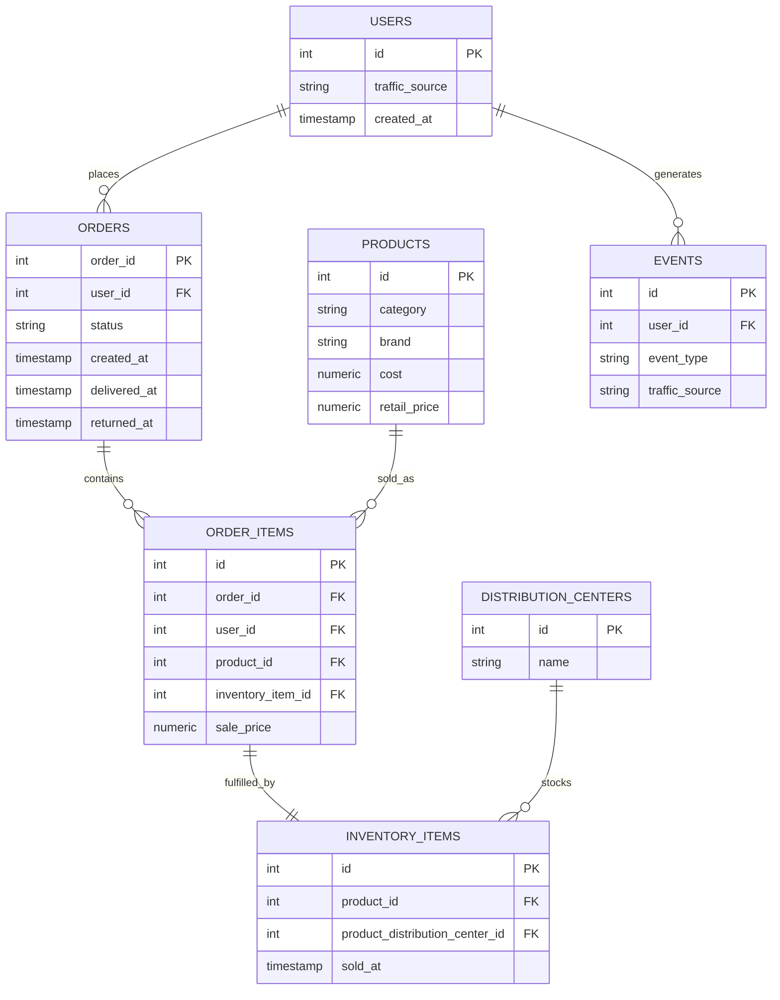

# Assets

Place for supporting images referenced by the README (e.g. an ERD export, a BigQuery screenshot, or a results chart) if you choose to add any. Nothing in this folder is required for the SQL to run it's purely for presentation.

